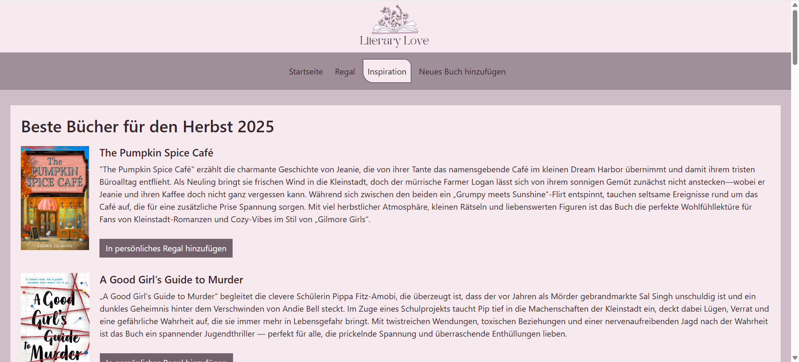

# Literary Love - Webseite zum Verwalten von Büchern
Literary Love ist ein Paradies für alle Buchliebhaber. Die persönliche Bibliothek ermöglicht es Nutzern den perfekten Überblick über alle Bücher zu behalten, egal ob aktuelle Lektüre, Lesewunsch oder bereits ein gelesenes Buch. Literary Love ermöglicht ihren Nutzern durch ihr schlichtes und zugleich modernes Design sowie den vielen Funktionalitäten und der eigenen Inspirationsseite eine ausgezeichnete Nutzererfahrung. 

## Features
- Alle Bücher im Regal einsehen
- Bücher nach Titel, Autor, Status und Rating filtern
- Neues Buch erstellen und ins Regal hinzufügen
- Wichtigsten Informationen zum Buch schon im Regal einsehen
- Beim Klick auf "mehr zum Buch" des jeweiligen Buches Details einsehen
- Fortschritt in Prozentangaben im Blick behalten
- Notizen mit Meinungen, Zusammenfassungen oder Anmerkungen zum Buch erstellen
- Bucheinträge bearbeiten
- Bucheinträge löschen
- Im Bereich Inspiration neue Bücher entdecken und mit einem Klick ins eigene Regal hinzufügen
- Benutzerfreundliches Design

## Technologien
- **CSS-Framework:** Bootstrap
- **Frontend:** Angular
- **Backend:** Node.js
- **Datenbank:** MongoDB Atlas

## Screenshots
### Startseite
Kurze Vorstellung der Webseite


### Regal
Hier befinden sich alle Bücher


### Regal mit offenem Buch
Wenn man auf ein Buch klickt oder mit dem Cursor raufgeht, klappt sich das Buch auf und man sieht die wichtigsten Informationen zum jeweiligen Buch


### Details 
Hier findet man noch mehr Details zu einem Buch


### Buch bearbeiten
Hier kann man Informationen zum Buch bearbeiten wie zum Beispiel Rating, gelesene Seiten und Notizen


### Neues Buch hinzufügen
Ein neues Buch erstellen, das Formular ausfüllen und ins Regal hinzufügen


###  Anzeige: Buch hinzugefügt
Nach erfolgreichen Hinzufügen, bekommt man eine Anzeige, dass alles geklappt hat und man das Buch nun im Regal findet


### Nach Buch filtern
### Suchfunktion
Im Regal kann mit der Suchfunktion nach Titel oder Autor suchen


### Filtern nach Status
Außerdem kann man nach dem Status filtern und so seine aktuellen Lektüren oder Lesewünsche mit nur zwei Klicks sehen


### Filtern nach Rating
Zudem kann man nach dem Rating filtern und so die Lieblingsbücher schnell wiederfinden


### Kein Buch gefunden
Wenn kein Buch gefunden wurde, sieht man es in der kleinen Anzeige


### Buch löschen
Man kann Bücher auch löschen


###  Anzeige: Buch gelöscht
Bevor dies aber geschieht, wird nochmal sichergestellt, dass der Nutzer dies wirklich will


### Inspiration
In den Artikeln von Literary Love findet man viele coole Bücher, die von der Erfinderin empfohlen werden


###  Anzeige: Buch von Inspiration in Regal hinzugefügt
Man kann sich die Bücher mit einem Klick in das eigene Regal holen


### Mobile Version
Literary Love ist auch für kleine Geräte optimal gedacht
### Regal für Tablet
Auf dem Tablet sieht man zwei Bücher in einer Reihe


### Regal für Smartphone
Auf dem Handy sieht man immer ein Buch in der Reihe


## Installation

### Voraussetzungen

Dies sollte man schon installiert haben:

- Angular
- Node.js
- MongoDB (Atlas oder lokal)

### Repository clonen
```

git clone https://github.com/s0597065/Webtech2025.git
cd Webtech2025

```
### Backend Einrichtung
In backend Ordner wechseln
```

cd backend
npm install

```
Server starten
```

node server.js

```
### Frontend Einrichtung 

in Semesteraufgabe Ordner wechseln
```

cd ../Semesteraufgabe
npm install

```
Frontend starten
```

ng serve

```

## Nützliche Videos, Artikel, Webseiten
- Für das Aufklappen des Buches hat mir diese Webseite geholfen: [hier](https://uiverse.io/eslam-hany/selfish-bobcat-73)

- Für die Suchfunktion hat mir dieser Artikel geholfen: [hier](https://v17.angular.io/tutorial/first-app/first-app-lesson-13)

- Für das Erstellen der ReadMe war dieses Video sehr hilfreich: [hier](https://www.youtube.com/watch?v=EN6d6djVIJI)

- Mein Design habe ich mit Canva erstellt (als Prototyp), Hilfe bei den Farben und der Strukturierung
  
## KI-Nutzung
1. **Perplexity.ai:** Beschreibungen der Bücher für die Inspirationsseite, 
2. **Chat GPT:** Erklärungen zu Fehlermeldungen, Hilfe bei Codeoptimierung, Einrichtung und Verständnisfragen

## Künftige Erweiterungen
- Registrierung
- Login
- Favicon einbinden

## Autorin
Diana Kraus - Projekt für das Modul Webtechnologien

